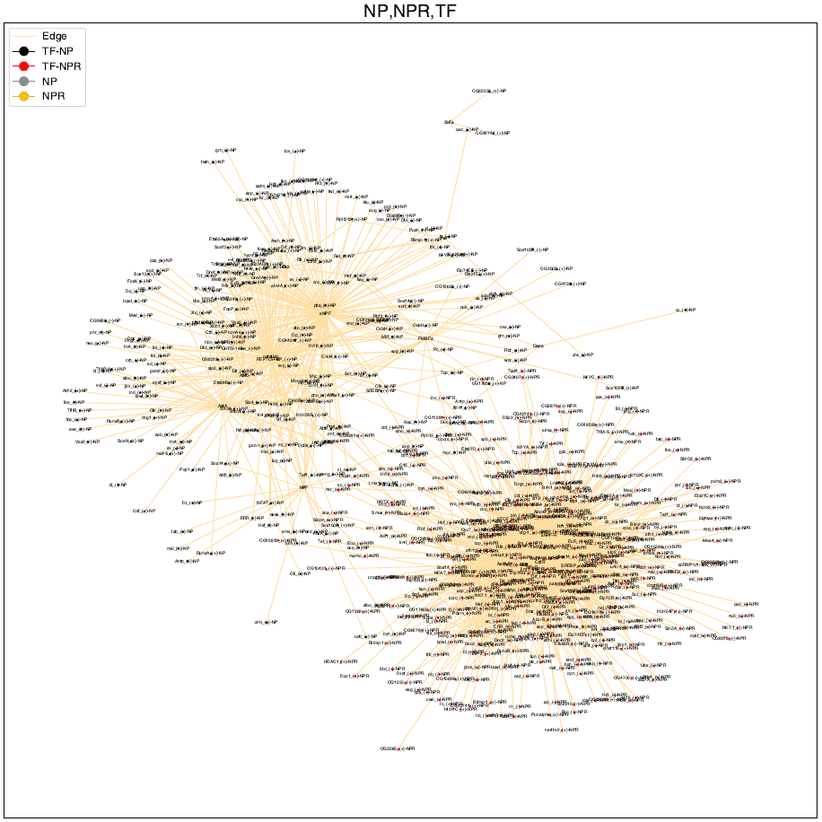

# TFs, NPs, NPRs Network

This repository provides the data and source code used in the paper(https://www.biorxiv.org/content/10.1101/2024.11.23.624967v1).

## Data Curation and Processing

Using the Fly Cell Atlas platform, which provides single-cell RNA sequencing (snRNA-seq) data, 
a total of 17 loom files were obtained for tissue snRNA-seq data. 
The fly cell atlas portal (https://flycellatlas) was utilized. 
Using a Python program, data on tissue, genes, cells, gene expression levels in cells, 
and motif expression levels in cells were stored in a MySQL database via the Python package scanpy. 
In these files, the number of tissues stored is 17, genes are 16,373, cells are 507,827
and TFs are 565. Approximately 450 million gene expression records were stored. 
The pre-built MySQL database contains about 21G of data, allowing for checking 
gene expression across the entire Drosophila, not limited to tissues, using SQL queries.
The missing genetic information could also be constructed from the gene table data obtained 
from the file gene_rpkm_matrix_fb_2021_06.tsv, which was downloaded from FlyBase(https://flybase.org/).

## Visualization of NPs, NPRs, and TFs Network

10 NPs and 13 NPRs required for the TF network experiment were selected. In the Fly Cell Atlas, 
TF-related information is organized using the AUCell algorithm. We used the relational data between these genes and TFs.
1) To maximize the difference between NP and NPR, cells where NP and NPR are co-expressed were excluded.
2) Cells where TF is co-expressed in cells where NP and NPR are expressed separately were extracted.
3) TF expression data were extracted from cells expressing NP and NPR.
4) Networks were connected where NP and TF were expressed in the same cells.
5) Networks were connected where NPR and TF were expressed in the same cells.
Through network graphs, it was possible to easily visualize the regulatory differences of TFs between NP and NPR. 
The network was implemented using the Python packages matplotlib and networkx. 

